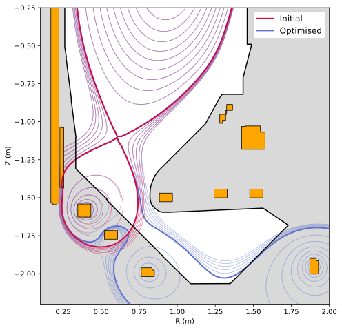
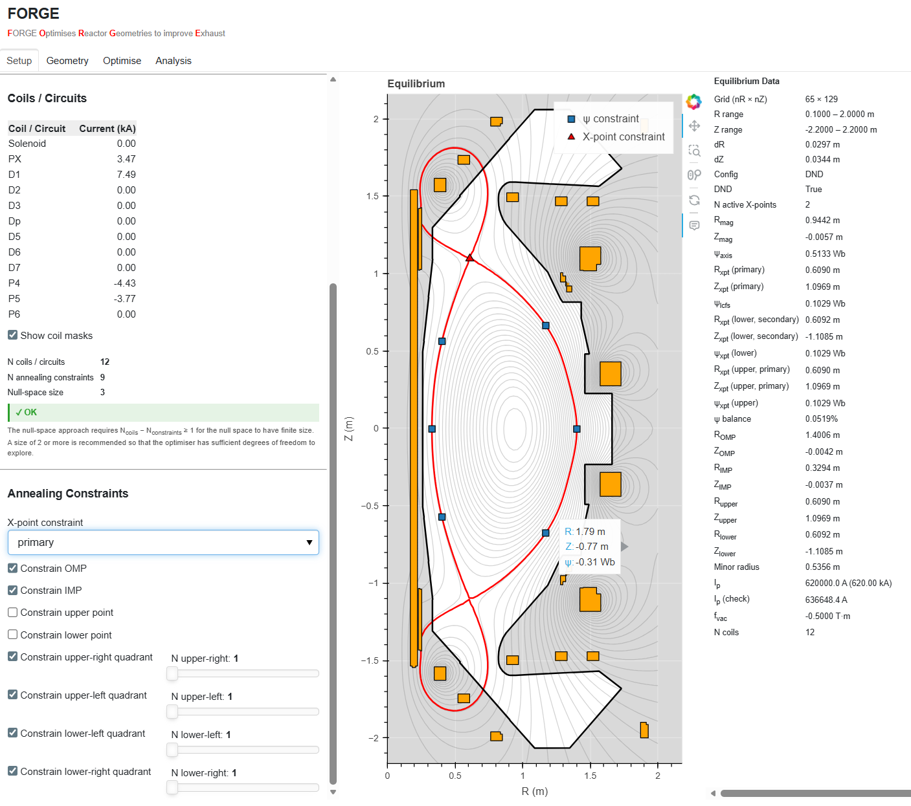

# FORGE

<p align="center">
  
</p>

<p align="center">
  <em><b>F</b>ORGE <b>O</b>ptimises <b>R</b>eactor <b>G</b>eometries to improve <b>E</b>xhaust</em>
</p>

<p align="center">
  <a href="https://www.gnu.org/licenses/lgpl-3.0"></a>
  
  <a href="https://forgexhaust.readthedocs.io/en/latest/"></a>
  <a href="https://github.com/FORGExhaust/FORGE/actions/workflows/ci.yml"></a>
</p>

---

FORGE is a Python tool for optimising the magnetic geometry of tokamak
divertors. Given a GEQDSK equilibrium and a description of the poloidal-field
coils, it tunes coil currents using a simulated annealing optimisation algorithm to reshape the
magnetic geometry of the divertor region(s) — improving strike-point placement, connection length, and
detachment conditions — whilst leaving the core plasma unchanged. In this way, FORGE enables a decoupling
of the production of a suitable free-boundary equilibrium that captures the geometry of the core plasma from the design of the divertor geometry, eliminating the need for the repeated usage of a free-boundary solver. FORGE comes
with a GUI to help the user setup their optimisation problem in a visual and intuitive way.





## Community

FORGE is device-agnostic — whilst the bundled examples use a MAST-U
geometry, it can be applied to any tokamak for which you have a GEQDSK
equilibrium and a PF coil description. If you are interested in using
FORGE, have questions, or would like to contribute to its development,
please join the discussion on the
**[FORGE Discord server](https://discord.gg/8qStbSTNEy)**.

## Documentation

Full documentation is available at **[https://forgexhaust.readthedocs.io](https://forgexhaust.readthedocs.io/en/latest/index.html)**, including:

- [Installation](https://forgexhaust.readthedocs.io/en/latest/installation.html) — setup instructions
- [How It Works](https://forgexhaust.readthedocs.io/en/latest/how_it_works.html) — the physics and algorithms behind FORGE
- [Getting Started](https://forgexhaust.readthedocs.io/en/latest/getting_started.html) — input formats and a worked example
- [GUI](https://forgexhaust.readthedocs.io/en/latest/gui.html) — graphical interface (under development)
- [API Reference](https://forgexhaust.readthedocs.io/en/latest/api_reference.html) — auto-generated module documentation
- [Examples](https://forgexhaust.readthedocs.io/en/latest/examples.html) — seven progressive example scripts on MAST-U

To build the docs locally:

```bash
pip install -e ".[docs]"
cd docs
make html
# open build/html/index.html
```

## Installation

### From source

```bash
git clone https://github.com/FORGExhaust/FORGE.git
cd forge
pip install .
```

### Editable (development) install

```bash
git clone https://github.com/FORGExhaust/FORGE.git
cd forge
pip install -e ".[test,docs]"
```

### Dependencies

| Package | Minimum version |
|---------|-----------------|
| NumPy | 1.26.3 |
| Matplotlib | 3.7.5 |
| SciPy | 1.11.4 |
| Shapely | 2.0.1 |
| freeqdsk | 0.4.0 |

## Contributing

<!-- TODO: expand once contribution guidelines are finalised -->
Contributions are welcome! If you would like to contribute:

1. Fork the repository
2. Create a feature branch (`git checkout -b feature/my-feature`)
3. Commit your changes (`git commit -m "Add my feature"`)
4. Push to the branch (`git push origin feature/my-feature`)
5. Open a Pull Request into the dev branch.

Please ensure new code includes appropriate tests, docstrings and updated documentation where relevant.

## Citation

If you use FORGE in your research, please cite:

<!-- TODO: add DOI / BibTeX once available -->
```bibtex
@software{forge,
  author  = {Marsden, Chris},
  title   = {{FORGE}: {F}ORGE {O}ptimises {R}eactor {G}eometries to improve {E}xhaust},
  url     = {https://github.com/FORGExhaust/FORGE},
  version = {1.0.0},
  year    = {2026}
}
```

## Authors and Acknowledgements

- **Chris Marsden** — project lead and primary developer
- **Sebastien Shaw** — foundational work during a FOSTER summer placement (2025)
- **Nathan Welch** — [SCOPE](https://arxiv.org/pdf/2512.16546) project lead; guidance on the simulated annealing approach

FORGE builds on several routines from
[FreeGS](https://github.com/freegs-plasma/freegs) (Ben Dudson et al.),
which are used under the terms of the LGPL-3.0 licence. See the
individual source files for details.

FORGE was initially developed at [Tokamak Energy](https://github.com/tokamak-energy).

The FORGE GUI is built with
[Panel](https://panel.holoviz.org/) and
[Bokeh](https://bokeh.org/):

<p>
  <a href="https://panel.holoviz.org/">
    
  </a>
  &nbsp;&nbsp;
  <a href="https://bokeh.org/">
    
  </a>
</p>

## License

FORGE is released under the
[GNU Lesser General Public License v3.0](https://www.gnu.org/licenses/lgpl-3.0.html).
See [LICENSE](LICENSE) for the full text.

The bundled MAST-U example data is provided under
[CC BY-NC-SA 4.0](https://creativecommons.org/licenses/by-nc-sa/4.0/).
See the documentation [licence page](https://forgexhaust.readthedocs.io/en/latest/license.html) for details.

**Note:** The MAST-U machine configuration represented by the bundled data
corresponds to the MAST-U device as operated during the period 2020–2025.
Any subsequent modifications to the machine are not reflected in these data.