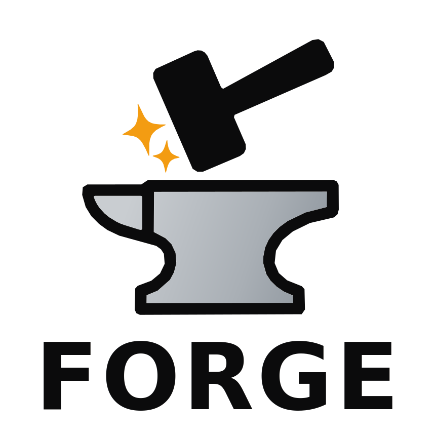

**************************
FORGE Documentation
**************************

.. rst-class:: centered

**FORGE** - **F**\ ORGE **O**\ ptimises **R**\ eactor **G**\ eometries to improve **E**\ xhaust

FORGE is a Python-based tool for optimising the magnetic geometry of
tokamak divertors. It takes a standard GEQDSK equilibrium file and a
description of the PF coils, then tunes the coil currents using
a simulated annealing algorithm to improve the magnetic geometry of one or
more of the divertor regions, all whilst preserving the geometry of the core plasma.
In this way, FORGE provides a means by which a free-boundary equilibrium can be altered to improve
the divertor magnetic geometry, without the need to actually re-run a free-boundary equilibrium solver.
FORGE can be used in two ways: via **Python scripts** or through a
**graphical user interface** (GUI). The script-based workflow is fully
documented in the :doc:`getting started <getting_started>` guide; the GUI
is documented on the :doc:`gui` page.

To learn more about the principles behind FORGE, please see the :doc:`how it works <how_it_works>`
page. Once you have :doc:`installed the code<installation>` and are ready to get started, check out the :doc:`getting started <getting_started>`
guide, which provides a quick introduction to using FORGE via scripts.

Contents
--------

.. toctree::
   :maxdepth: 1
   :caption: User Guide

   installation
   how_it_works
   getting_started
   gui
   examples
   changelog
   license

.. toctree::
   :maxdepth: 1
   :caption: Reference

   api_reference

Indices and tables
==================

* :ref:`genindex`
* :ref:`modindex`
* :ref:`search`
